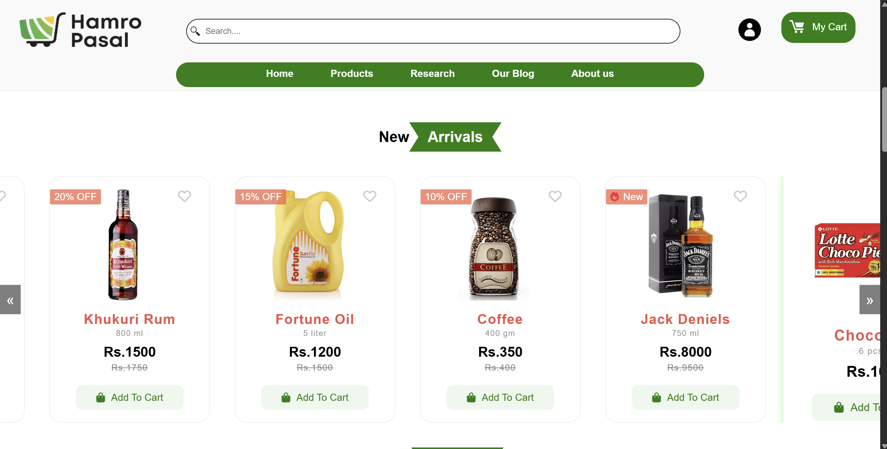
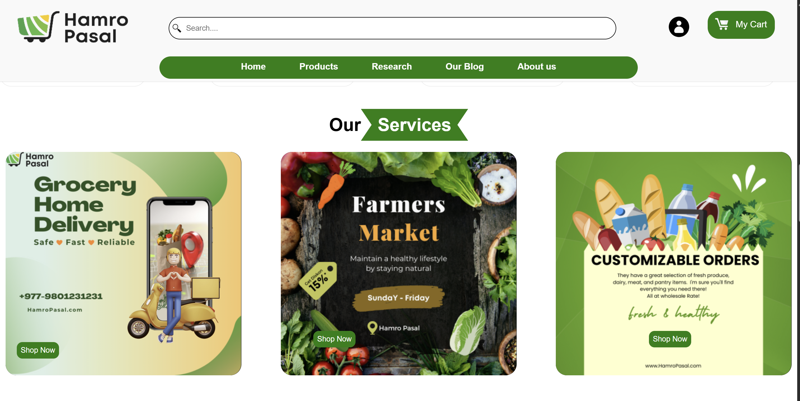

# Hamro-Pasal

Hamro-Pasal is a static e-commerce web application designed to simulate a simple online grocery store. It allows users to view available products and understand the layout and structure of an e-commerce platform.

## Features

- Static layout with HTML, CSS JS
- Clean UI for products browsing


## Screenshots
Home page

Product page

Features

Login

Product


## Technologies Used

- HTML5
- CSS3
- JavaScript (optional, if used)

## How to Run

1. Clone the repository:
   ```bash
   git clone https://github.com/Nikesh-Shah/Hamro-Pasal.git
